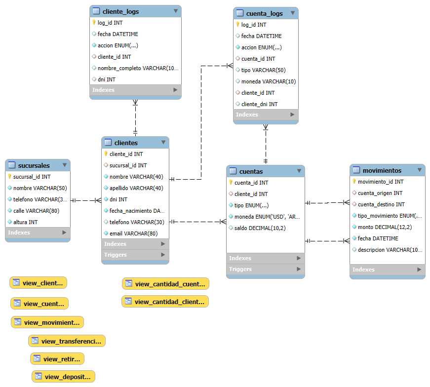

# Proyecto Base de Datos.

### **Entrega N°1 Proyecto Base de Datos. *Coderhouse.***

### Tema: **Sistema Bancario**. 

### ÍNDICE

- ### [Introducción](#introducción-1)
- ### [Archivos](#archivos-1)
- ### [Diagrama ER](#diagrama-entidad-relación)
- ### [Modelado de Tablas](#modelado-de-tablas-1)
- ### [Funciones](#funciones-1)
- ### [Vistas](#vistas-1)
- ### [Procedimientos](#procedimientos-1)
- ### [Disparadores](#triggers)

## INTRODUCCIÓN

Este sistema representado en MySQL tiene el objetivo de administrar la información interna de un banco ficticio.

Se utilizarán las siguientes tablas:

- **Sucursales:** Contiene las direcciones y los numeros de telefono de cada sucursal
- **Clientes:** Contiene información sobre los clientes pertenecientes a cada sucursal.
- **Cuentas:** Guarda información sobre los tipos de cuenta, saldos sobre las cuentas de los clientes.
- **Movimientos:** Tiene datos de transferencias, depositos y retiros de las cuentas de los clientes.
- **Logs**: Tiene un registro historico para cada cuenta y cliente creada, modificada o eliminada.

## ARCHIVOS
Las tablas están divididas en **6 archivos principales** para crear correctamente la base de datos.

Ejecutar en el siguiente orden cada archivo:

- **01_tablas.sql**
- **02_funciones.sql** 
- **03_procedimientos.sql**
- **04_vistas.sql**
- **05_triggers.sql**
- **06_datos_prueba.sql**

## DIAGRAMA ENTIDAD-RELACIÓN

## MODELADO DE TABLAS
###### Ver **[01_tablas.sql](./01_tablas.sql)**

### Sucursales
---
|  KEY  |     Campo      |       Tipo       |         Atributos         |        Referencias          |
|-------|----------------|------------------|---------------------------|-----------------------------|
|**PK** |sucursal_id     |**INT**           |AUTO_INCREMENT             |                             |
|       |nombre          |VARCHAR **(50)**  |NOT NULL                   |                             |
|       |telefono        |VARCHAR **(30)**  |NOT NULL                   |                             |
|       |calle           |VARCHAR **(80)**  |NOT NULL                   |                             |
|       |altura          |**INT**           |NOT NULL, UNSIGNED         |                             |

### Clientes
---
|  KEY  |    Campo       |       Tipo       |         Atributos         |        Referencias          |
|-------|----------------|------------------|---------------------------|-----------------------------|
|**PK** |cliente_id      |**INT**           |AUTO_INCREMENT             |                             |
|**FK** |sucursal_id     |**INT**           |                           |sucursales **(sucursal_id)** |
|       |nombre          |VARCHAR **(40)**  |NOT NULL                   |                             |
|       |apellido        |VARCHAR **(40)**  |NOT NULL                   |                             |
|       |dni             |**INT**           |NOT NULL, UNSIGNED, UNIQUE |                             |
|       |fecha_nacimiento|**DATE**          |NOT NULL                   |                             |
|       |telefono        |VARCHAR **(30)**  |NOT NULL, UNSIGNED, UNIQUE |                             |
|       |email           |VARCHAR **(80)**  |UNSIGNED, NOT NULL         |                             |

### Cuentas
---
|  KEY  |    Campo       |        Tipo       |         Atributos         |        Referencias         |
|-------|----------------|-------------------|---------------------------|----------------------------|
|**PK** |cuenta_id       |**INT**            |AUTO_INCREMENT             |                            |
|**FK** |cliente_id      |**INT**            |                           |clientes **(cliente_id)**   |
|       |tipo            |ENUM **(...)**     |NOT NULL                   |                            |
|       |moneda          |ENUM **(...)**     |NOT NULL                   |                            |
|       |saldo           |DECIMAL **(10, 2)**|UNSIGNED **DEFAULT 0**     |                            | 

### Movimientos
---
|  KEY  |    Campo       |        Tipo       |         Atributos         |        Referencias         |
|-------|----------------|-------------------|---------------------------|----------------------------|
|**PK** |movimiento_id   |**INT**            |AUTO_INCREMENT             |                            |
|**FK** |cuenta_origen   |**INT**            |                           |cuentas **(cuenta_id)**     |
|**FK** |cuenta_destino  |**INT**            |                           |cuentas **(cuenta_id)**     |
|       |tipo_movimiento |ENUM **(...)**     |NOT NULL **DEFAULT ...**   |                            |
|       |monto           |DECIMAL **(12, 2)**|NOT NULL, UNSIGNED         |                            |
|       |fecha           |**DATETIME**       |NOT NULL, **DEFAULT ...**  |                            |
|       |descripcion     |VARCHAR **(100)**  |                           |                            |

## FUNCIONES
###### Ver **[02_funciones.sql](./02_funciones.sql)**

**FULLNAME**
Concatena dos cadenas de texto con un espacio en el medio. Generalmente utilizada para unir nombre y apellido.

## VISTAS

###### Ver **[03_vistas.sql](./03_vistas.sql)**

- ### **view_clientes**: 
Devuelve todos los clientes y la sucursal a la que pertenecen.

- ### **view_cuentas**:
Devuelve todas la cuentas y el cliente al cual pertenecen.

- ### **view_movimientos**:
Muestra los depositos, retiros y las transferencias de todos los clientes.

- ### **view_depositos**:
Muestra solo los depositos de los clientes.

- ### **view_retiros**:
Muestra todos los retiros de los clientes.

- ### **view_transferencias**:
Muestra todas las transferencias de los clientes.

- ### **view_cantidad_cuentas**:
Devuelve la cantidad de cuentas por cliente.

- ### **view_cantidad_cuentas**:
Devuelve la cantidad de clientes por sucursal.

## PROCEDIMIENTOS
###### Ver **[04_procedimientos.sql](./04_procedimientos.sql)**

### **Insersiones generales.**

#### **Sucursales.**
- **insertar_sucursal**(*...*)

#### **Clientes.**
- **insertar_cliente**(*...*)

#### **Cuentas.**
- **insertar_cuentas**(*...*)

#### **Movimientos.**
- **insertar_transferencia**(*...*)
- **insertar_deposito**(*...*)
- **insertar_retiro**(*...*)

### **Búsquedas parametrizadas.**

#### **Sucursales.**
- **buscar_id_por_nombre**(*...*)
- **listar_clientes_por_sucursal**(*...*)

#### **Clientes.**
- **buscar_cliente_por_id**(*...*)
- **buscar_cliente_por_dni**(*...*)
- **listar_cuentas_por_cliente**(*...*)

#### **Cuentas.**
- **buscar_cuenta_por_id**(*...*)

#### **Movimientos.**
- **buscar_movs_por_fecha**(*...*)

### **Insersiones de logs.**

#### **Registros**

- **registrar_cliente**(*...*)
- **registrar_cuenta**(*...*)

## TRIGGERS
###### Ver **[05_triggers.sql](./05_triggers.sql)**.

### **Insersiones**

#### **Clientes**
- **insertar_cliente** *AFTER INSERT ON clientes*

#### **Cuentas**
- **insertar_cuenta** *AFTER INSERT ON cuentas*

---

Proyecto Realizado por **Viz Valentín.**

Primera Modificación: *11/08/25*

Última modificación:  *07/09/25*

