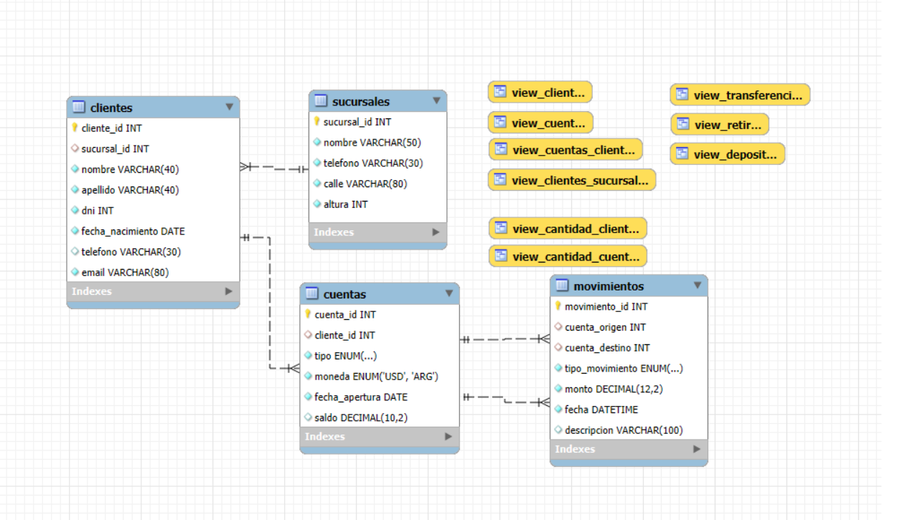

# Proyecto Base de Datos.

### ▶ **Entrega N°1 Proyecto Base de Datos. *Coderhouse.***

### ▶ Temática: **Sistema Bancario**. 

### ÍNDICE

- ### [Introducción](#️introducción)
- ### [Objetivos](#objetivos)
- ### [Situacion problematica](#situación-problemática)
- ### [Modelo de negocio](#módelo-de-negocio)
- ### [Diagrama](#diagrama-entidad-relación)
- ### [Entidades](#entidades)
    - #### [Sucursales](#sucursales-1)
    - #### [Clientes](#clientes-1)
    - #### [Cuentas](#cuentas-1)
    - #### [Movimientos](#movimientos-1)
- ### [Vistas](#vistas-1)
    - #### [Clientes](#view_clientes)
    - #### [Cuentas](#view_cuentas)
    - #### [Clientes y sucursales](#view_clientes_sucursales)
    - #### [Cuentas y clientes](#view_cuentas_clientes)
    - #### [Depositos](#view_depositos)
    - #### [Retiros](#view_retiros)
    - #### [Transferencias](#view_transferencias)
    - #### [Cantidad de clientes](#view_cantidad_clientes)
    - #### [Cantidad de cuentas](#view_cantidad_cuentas)

## INTRODUCCIÓN

Se presenta la **primer entrega** de un módelo básico de un sistema bancario simple dividido en cuatro archivos iniciales: 

1. Creacion de tablas.
2. Inicializacion de tablas.
3. Creacion de vistas.
4. Lectura general.

## OBJETIVOS

Organizar la información en tablas de sucursales, clientes, cuentas y movimientos.

## SITUACIÓN PROBLEMÁTICA

Una organización tiene mucha demora al tener que consultar por información de muchos clientes cuando debe realizar auditorias o procesos burocráticos. Entonces se decide implementar un proceso de digitalización de información, con el fin de agilizar los procesos de consulta.

## MÓDELO DE NEGOCIO
Una entidad financiera se encarga de organizar las siguientes tablas.

 - Sucursales
 - Clientes
 - Cuentas
 - Movimientos

## DIAGRAMA ENTIDAD-RELACIÓN

## ENTIDADES

 - ### Sucursales
---
|  KEY  |     Campo      |       Tipo       |         Atributos         |        Referencias          |
|-------|----------------|------------------|---------------------------|-----------------------------|
|**PK** |sucursal_id     |**INT**           |AUTO_INCREMENT             |                             |
|       |nombre          |VARCHAR **(50)**  |NOT NULL                   |                             |
|       |telefono        |VARCHAR **(30)**  |NOT NULL                   |                             |
|       |calle           |VARCHAR **(80)**  |NOT NULL                   |                             |
|       |altura          |**INT**           |NOT NULL, UNSIGNED         |                             |

- ### Clientes
---
|  KEY  |    Campo       |       Tipo       |         Atributos         |        Referencias          |
|-------|----------------|------------------|---------------------------|-----------------------------|
|**PK** |cliente_id      |**INT**           |AUTO_INCREMENT             |                             |
|**FK** |sucursal_id     |**INT**           |                           |sucursales **(sucursal_id)** |
|       |nombre          |VARCHAR **(40)**  |NOT NULL                   |                             |
|       |apellido        |VARCHAR **(40)**  |NOT NULL                   |                             |
|       |dni             |**INT**           |NOT NULL, UNSIGNED, UNIQUE |                             |
|       |fecha_nacimiento|**DATE**          |NOT NULL                   |                             |
|       |telefono        |VARCHAR **(30)**  |NOT NULL, UNSIGNED, UNIQUE |                             |
|       |email           |VARCHAR **(80)**  |UNSIGNED, NOT NULL         |                             |

- ### Cuentas
---
|  KEY  |    Campo       |        Tipo       |         Atributos         |        Referencias         |
|-------|----------------|-------------------|---------------------------|----------------------------|
|**PK** |cuenta_id       |**INT**            |AUTO_INCREMENT             |                            |
|**FK** |cliente_id      |**INT**            |                           |clientes **(cliente_id)**   |
|       |tipo            |ENUM **(...)**     |NOT NULL                   |                            |
|       |moneda          |ENUM **(...)**     |NOT NULL                   |                            |
|       |fecha_apertura  |**DATE**           |NOT NULL                   |                            |
|       |saldo           |DECIMAL **(10, 2)**|UNSIGNED **DEFAULT 0**     |                            | 

- ### Movimientos
---
|  KEY  |    Campo       |        Tipo       |         Atributos         |        Referencias         |
|-------|----------------|-------------------|---------------------------|----------------------------|
|**PK** |movimiento_id   |**INT**            |AUTO_INCREMENT             |                            |
|**FK** |cuenta_origen   |**INT**            |                           |cuentas **(cuenta_id)**     |
|**FK** |cuenta_destino  |**INT**            |                           |cuentas **(cuenta_id)**     |
|       |tipo_movimiento |ENUM **(...)**     |NOT NULL **DEFAULT ...**   |                            |
|       |monto           |DECIMAL **(12, 2)**|NOT NULL, UNSIGNED         |                            |
|       |fecha           |**DATETIME**       |NOT NULL, **DEFAULT ...**  |                            |
|       |descripcion     |VARCHAR **(100)**  |                           |                            |

## VISTAS

 ### view_clientes

 Muestra **todos** los **clientes** *existentes*.

 - **cliente**
 - **dni**
 - **edad**
 - **telefono**
 - **email**

### view_cuentas

 Muestra **todas** las **cuentas** *existentes*.

 - **no_cuenta**
 - **fecha_apertura**
 - **tipo**
 - **moneda**
 - **saldo**

 ### view_clientes_sucursales

 Muestra **todos** los **clientes** y sus **sucursales**.

 - **sucursal**
 - **direccion**
 - **nombre_completo**
 - **dni**
 - **telefono**
 - **email**

### view_cuentas_clientes

 Muestra **todas** las **cuentas** por cada **cuentas**.

 - **dni**
 - **nombre_completo**
 - **tipo**
 - **moneda**
 - **fecha_apertura**

### view_depositos

 Muestra **todos** los **depositos** realizados.

 - **no_cuenta**
 - **monto**
 - **fecha**

### view_retiros

 Muestra **todos** los **retiros** realizados.

 - **no_cuenta**
 - **monto**
 - **fecha**

### view_transferencias

 Muestra **todas** las **transferencias** realizadas.

 - **cuenta_origen**
 - **cliente_origen**
 - **monto**
 - **descripcion**
 - **cuenta_destino**
 - **cliente_destino**
 - **fecha**

### view_cantidad_clientes

 Muestra un **conteo** de **clientes** por cada **sucursal**.

 - **nombre**
 - **clientes**

### view_cantidad_cuentas

 Muestra un **conteo** de **cuentas** por cada **cliente**.

 - **dni**
 - **nombre_completo**
 - **cuentas**

---

Proyecto Realizado por **Viz Valentín.**

Ultima modificación: 11/08/25

: - )

